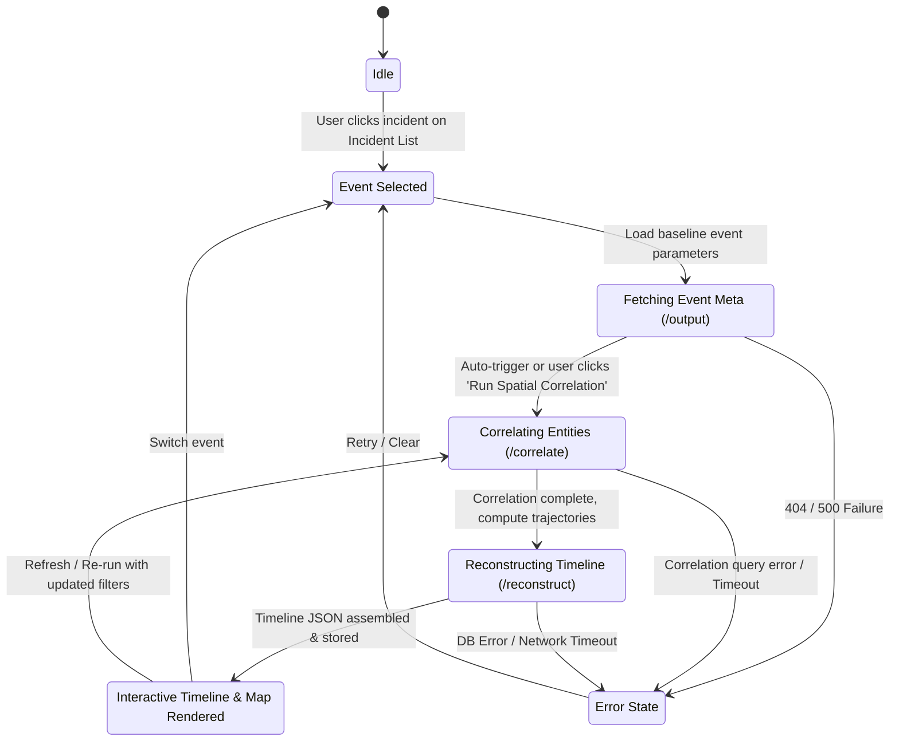

# 📦 Master System & Feature Handoff Specification
**Project / Module Name:** VIGRAH AI — Spatial Reconstruction & Temporal Correlation Engine (Layer 3 & Layer 4)  
**Contributor / Owner:** Principal Systems & Integration Engineering  
**Readiness Level:** Production-Ready (Core API, PostGIS Analytics, Trajectory Math, & Timeline Persistence fully verified)  
**Tech Stack & Runtime:** Python 3.11 / FastAPI, SQLAlchemy 2.0, GeoAlchemy2, PostGIS / PostgreSQL, Uvicorn  

---

## 1. 🏗️ Architecture, Execution Path & Flow

- **High-Level Purpose:**  
  The VIGRAH Reconstruction & Spatial Correlation Engine provides spatial-temporal correlation and automated scene timeline reconstruction for surveillance and incident intelligence. It ingests detected incident events (`public.events`), correlates them against entity sightings (`public.entity_sightings`) within dynamic spatial-temporal buffers (`ST_DWithin` & time intervals), classifies candidate entities (e.g., witnesses, vehicles, persons), computes kinematics/trajectories across multi-camera feeds with incremental distance and time deltas, and persists the reconstructed chronological scene timeline directly into PostgreSQL/PostGIS as structured JSONB documents.

- **File & Directory Map:**
  - `app/main.py` -> FastAPI application definition exposing REST endpoints (`/events/{event_id}/correlate`, `/events/{event_id}/reconstruct`, `/events/{event_id}/output`).
  - `app/correlate.py` -> Spatial-temporal correlation driver executing parameterized PostGIS queries against event coordinate buffers.
  - `app/mapping.py` -> Entity-to-event association persistence and classification upsert pipeline (`public.event_entity_mapping`).
  - `app/classify.py` -> Conservative explainable entity classification policy engine (`WITNESS`, `SUSPECT`, `VICTIM`).
  - `app/reconstruction.py` -> Primary reconstruction assembler fetching correlated entities, compiling trajectory paths, updating `public.events.reconstructed_timeline`, and emitting full structured timeline documents.
  - `app/trajectory.py` -> PostGIS window function query builder (`LAG(geom)`, `LAG(timestamp)`) calculating camera sequences, geographical coordinates (`ST_X`, `ST_Y`), step distance (`ST_Distance` in meters), and step time (`EXTRACT(EPOCH)` in seconds).
  - `app/event_output.py` -> Standardized Layer 4 event metadata query and severity normalizer (`low`, `medium`, `high`).
  - `app/config.py` -> Dynamic correlation window thresholds (`time_minutes`, `radius_meters`) keyed by incident type (`ACCIDENT`, `DEFAULT`).
  - `app/db.py` -> SQLAlchemy database connection pool (`pool_pre_ping=True`) and SessionLocal factory with `.env` loader.
  - `sql/find_candidates.sql` -> Optimized PostGIS query calculating spatial distance and minute offsets between incident center and camera sightings.
  - `tests/test_reconstruction.py` -> Unit test suite verifying timeline assembly, trajectory deltas, and DB persistence.
  - `tests/test_event_output.py` -> Unit test suite verifying severity mapping and Layer 4 payload contract.

- **Execution Mode & Latency Profile:**
  - **Type:** Instant Sync (<200ms) to Fast Async-Blocking DB Aggregations (200ms – 600ms depending on sighting density).
  - **Estimated Latency:**
    - `GET /events/{event_id}/output`: ~35ms – 75ms (Single index scan on `public.events`).
    - `POST /events/{event_id}/correlate`: ~120ms – 280ms (Spatial GIST index lookup + batch upsert into `event_entity_mapping`).
    - `POST /events/{event_id}/reconstruct`: ~180ms – 450ms (Multi-entity trajectory CTE computation with window functions + JSONB database write).

- **Data Flow Lifecycle:**
  1. **UI Trigger:** User selects an incident event on the Frontend Console and triggers "Correlate Entities" or "Reconstruct Timeline".
  2. **FastAPI Route Ingestion:** Request arrives at `POST /events/{event_id}/correlate` or `POST /events/{event_id}/reconstruct`.
  3. **Spatial Filtering & Sighting Retrieval:** `correlate.py` executes `sql/find_candidates.sql`, calculating geodesic distance (`ST_Distance`) and timestamp difference for sightings matching the event's type-specific radius (150m–200m) and temporal window (10–15 mins).
  4. **Entity Classification & Mapping:** `mapping.py` loads entity details from `public.entities`, applies rule-based classification in `classify.py`, and executes an idempotent `ON CONFLICT (event_id, track_id) DO UPDATE` into `public.event_entity_mapping`.
  5. **Kinematic Trajectory Reconstruction:** `reconstruction.py` calls `trajectory.py` for each correlated entity, executing a PostGIS SQL CTE that joins `public.entity_sightings` with `public.cameras`, computes windowed offsets via `LAG()`, and formats coordinate arrays.
  6. **JSONB Persistence:** The consolidated timeline payload is serialized and updated into `public.events.reconstructed_timeline`.
  7. **Response Normalization:** Structured JSON is returned to the Frontend containing normalized ISO 8601 timestamps, float coordinates, and metric values.

---

## 2. 📋 Strict Data Contracts & Schemas

### A. Input Payload (What Frontend Sends)

All endpoints utilize URL path parameters. No request body is required for GET or POST requests unless expanding parameter filters in future iterations.

#### 1. Correlate Entities
- **Method / Path:** `POST /events/{event_id}/correlate`
- **Path Parameters:**
  ```typescript
  interface CorrelateEventParams {
    event_id: string; // UUID v4 format (e.g. "aaaaaaaa-aaaa-aaaa-aaaa-aaaaaaaaaaaa")
  }
  ```

#### 2. Reconstruct Timeline
- **Method / Path:** `POST /events/{event_id}/reconstruct`
- **Path Parameters:**
  ```typescript
  interface ReconstructEventParams {
    event_id: string; // UUID v4 format
  }
  ```

#### 3. Fetch Event Output (Layer 4)
- **Method / Path:** `GET /events/{event_id}/output`
- **Path Parameters:**
  ```typescript
  interface GetEventOutputParams {
    event_id: string; // UUID v4 format
  }
  ```

---

### B. Output Payloads (What Backend Returns)

```typescript
// ==========================================
// 1. POST /events/{event_id}/correlate
// ==========================================

export interface CandidateSighting {
  sighting_id: string;
  track_id: string;
  camera_id: string;
  timestamp: string; // ISO 8601 string or SQL timestamp format
  proximity_meters: number; // Geodesic distance in meters
  minutes_offset: number; // Positive = after event, Negative = before event
}

export interface CorrelateEventResponse {
  event_id: string;
  candidate_count: number;
  saved_count: number;
  candidates: CandidateSighting[];
}

// ==========================================
// 2. POST /events/{event_id}/reconstruct
// ==========================================

export interface TrajectoryPoint {
  timestamp: string | null; // ISO 8601 string (e.g., "2026-08-16T04:58:00+00:00")
  camera_name: string | null; // Descriptive camera name or fallback camera_id
  latitude: number | null; // WGS84 Latitude (-90.0 to 90.0)
  longitude: number | null; // WGS84 Longitude (-180.0 to 180.0)
  distance_from_previous_meters: number | null; // null for origin sighting
  time_from_previous_seconds: number | null; // null for origin sighting
}

export interface ReconstructedEntity {
  track_id: string;
  entity_type: "PERSON" | "VEHICLE" | "BICYCLE" | string;
  association_type: "WITNESS" | "SUSPECT" | "VICTIM" | "UNKNOWN" | string;
  proximity_meters: number | null;
  trajectory: TrajectoryPoint[];
}

export interface ReconstructedEventMeta {
  event_id: string;
  event_type: "ACCIDENT" | "THEFT" | "CONGESTION" | "SECURITY_ALERT" | string;
  timestamp: string | null; // ISO 8601
  severity: number; // Integer severity rating (e.g. 1 - 5)
}

export interface ReconstructEventResponse {
  event: ReconstructedEventMeta;
  entities: ReconstructedEntity[];
}

// ==========================================
// 3. GET /events/{event_id}/output
// ==========================================

export type NormalizedSeverity = "low" | "medium" | "high";

export interface EventOutputResponse {
  event_id: string;
  timestamp: string | null; // ISO 8601
  latitude: number | null;
  longitude: number | null;
  event_type: string;
  severity: NormalizedSeverity; // Normalized: 1-2 -> "low", 3 -> "medium", 4-5 -> "high"
  source: string | null; // e.g. "camera", "sensor", "manual"
  confidence: number | null; // 0.0 to 1.0 (e.g. 0.91)
}

// ==========================================
// Standard API Error Response
// ==========================================

export interface APIErrorResponse {
  detail: string; // Error explanation (e.g., "Event not found: <uuid>")
}
```

---

## 3. 🗄️ Database & Entity Relationship Model

The engine operates on a relational PostGIS schema in the `public` namespace:

```
 ┌──────────────────────┐              ┌───────────────────────────┐
 │    public.events     │ 1          * │public.event_entity_mapping│
 ├──────────────────────┤──────────────├───────────────────────────┤
 │ event_id (PK, UUID)  │              │ event_id (FK, PK)         │
 │ event_type (VARCHAR) │              │ track_id (FK, PK)         │
 │ timestamp (TIMESTAMPTZ)             │ association_type (VARCHAR)│
 │ severity (INT)       │              │ proximity_meters (FLOAT)  │
 │ source (VARCHAR)     │              └─────────────┬─────────────┘
 │ confidence (FLOAT)   │                            │ *
 │ geom (GEOMETRY)      │                            │
 │ reconstructed_timeline (JSONB)                    │ 1
 └──────────────────────┘              ┌─────────────┴─────────────┐
                                       │      public.entities      │
                                       ├───────────────────────────┤
                                       │ track_id (PK, VARCHAR)    │
                                       │ entity_type (VARCHAR)     │
                                       │ first_seen (TIMESTAMPTZ)  │
                                       │ last_seen (TIMESTAMPTZ)   │
                                       └─────────────┬─────────────┘
                                                     │ 1
                                                     │
                                                     │ *
 ┌──────────────────────┐ 1          * ┌─────────────┴─────────────┐
 │    public.cameras    │──────────────│ public.entity_sightings   │
 ├──────────────────────┤              ├───────────────────────────┤
 │ camera_id (PK)       │              │ sighting_id (PK)          │
 │ camera_name (VARCHAR)│              │ track_id (FK)             │
 │ location_description │              │ camera_id (FK)            │
 │ geom (GEOMETRY)      │              │ timestamp (TIMESTAMPTZ)   │
 └──────────────────────┘              │ geom (GEOMETRY, Point)    │
                                       └───────────────────────────┘
```

---

## 4. 🔄 UI State Machine & Interaction Flows



### State Definitions & Frontend Actions:
1. **`Idle`**: No event selected. Display empty state with map centered on default city coordinates.
2. **`FetchingMeta`**: Show skeleton card for incident details (`latitude`, `longitude`, `event_type`, `severity` badge).
3. **`Correlating`**: Display loading indicator over "Correlated Entities" list. Show badge with `candidate_count` upon return.
4. **`Reconstructing`**: Display progression shimmer on Trajectory Map and Chronological Feed.
5. **`Ready`**:
   - Render incident pin on Map with severity-based pulsing halo.
   - Render multi-camera trajectory polyline paths color-coded per `track_id`.
   - Render step-by-step chronological timeline drawer with camera timestamps, distance stepped (meters), and transit time (seconds).
6. **`ErrorState`**: Display Toast / Banner with exact error string from `detail` and a "Retry" button.

---

## 5. 🔄 Data Transformers & Normalizers

Below are production-ready TypeScript data transformer functions to integrate into your Frontend state store or hooks layer:

```typescript
// src/lib/transformers/reconstructionTransformers.ts

import {
  ReconstructEventResponse,
  EventOutputResponse,
  TrajectoryPoint,
} from "../types/reconstruction";

export interface MapMarkerFeature {
  id: string;
  type: "event" | "sighting";
  coordinates: [number, number]; // [longitude, latitude] for MapLibre/Leaflet
  title: string;
  subtitle: string;
  properties: Record<string, any>;
}

export interface MapPolylineFeature {
  trackId: string;
  entityType: string;
  associationType: string;
  color: string;
  coordinates: [number, number][]; // LineString points [ [lng, lat], ... ]
  totalDistanceMeters: number;
  totalDurationSeconds: number;
}

export interface TimelineFeedItem {
  id: string;
  trackId: string;
  entityType: string;
  timestampFormatted: string;
  cameraName: string;
  metrics: {
    distanceFromPrev: string;
    timeFromPrev: string;
    speedMps?: string;
  };
  raw: TrajectoryPoint;
}

const ENTITY_COLOR_PALETTE = [
  "#3B82F6", // Blue
  "#10B981", // Emerald
  "#F59E0B", // Amber
  "#EC4899", // Pink
  "#8B5CF6", // Purple
  "#06B6D4", // Cyan
];

/**
 * Transforms backend reconstruct response into GeoJSON-compatible Map Polyline tracks
 */
export function transformToMapTracks(
  reconstruction: ReconstructEventResponse
): MapPolylineFeature[] {
  return reconstruction.entities.map((entity, index) => {
    const validPoints = entity.trajectory.filter(
      (p) => p.latitude !== null && p.longitude !== null
    );

    const coordinates = validPoints.map(
      (p) => [p.longitude!, p.latitude!] as [number, number]
    );

    const totalDistanceMeters = validPoints.reduce(
      (acc, p) => acc + (p.distance_from_previous_meters || 0),
      0
    );

    const totalDurationSeconds = validPoints.reduce(
      (acc, p) => acc + (p.time_from_previous_seconds || 0),
      0
    );

    const color =
      ENTITY_COLOR_PALETTE[index % ENTITY_COLOR_PALETTE.length];

    return {
      trackId: entity.track_id,
      entityType: entity.entity_type,
      associationType: entity.association_type,
      color,
      coordinates,
      totalDistanceMeters: Math.round(totalDistanceMeters * 10) / 10,
      totalDurationSeconds: Math.round(totalDurationSeconds),
    };
  });
}

/**
 * Flattens all entity trajectories into a unified, chronological timeline feed
 */
export function transformToChronologicalFeed(
  reconstruction: ReconstructEventResponse
): TimelineFeedItem[] {
  const items: TimelineFeedItem[] = [];

  reconstruction.entities.forEach((entity) => {
    entity.trajectory.forEach((point, pIdx) => {
      const dist = point.distance_from_previous_meters;
      const time = point.time_from_previous_seconds;

      let speedMps: string | undefined;
      if (dist && time && time > 0) {
        speedMps = (dist / time).toFixed(2) + " m/s";
      }

      items.push({
        id: `${entity.track_id}-step-${pIdx}`,
        trackId: entity.track_id,
        entityType: entity.entity_type,
        timestampFormatted: point.timestamp
          ? new Date(point.timestamp).toLocaleTimeString([], {
              hour: "2-digit",
              minute: "2-digit",
              second: "2-digit",
            })
          : "N/A",
        cameraName: point.camera_name || "Unknown Camera",
        metrics: {
          distanceFromPrev: dist !== null ? `${dist.toFixed(1)} m` : "Origin",
          timeFromPrev: time !== null ? `+${Math.round(time)}s` : "0s",
          speedMps,
        },
        raw: point,
      });
    });
  });

  // Sort ascending chronologically
  return items.sort((a, b) => {
    const timeA = a.raw.timestamp ? new Date(a.raw.timestamp).getTime() : 0;
    const timeB = b.raw.timestamp ? new Date(b.raw.timestamp).getTime() : 0;
    return timeA - timeB;
  });
}
```

---

## 6. 🧪 Realistic Mock Fallbacks & Fixtures

Use these mock fixtures when the backend or PostGIS database is unreachable:

### Mock 1: `GET /events/aaaaaaaa-aaaa-aaaa-aaaa-aaaaaaaaaaaa/output`
```json
{
  "event_id": "aaaaaaaa-aaaa-aaaa-aaaa-aaaaaaaaaaaa",
  "timestamp": "2026-08-16T05:00:00+00:00",
  "latitude": 19.076,
  "longitude": 72.8777,
  "event_type": "ACCIDENT",
  "severity": "high",
  "source": "camera",
  "confidence": 0.91
}
```

### Mock 2: `POST /events/aaaaaaaa-aaaa-aaaa-aaaa-aaaaaaaaaaaa/correlate`
```json
{
  "event_id": "aaaaaaaa-aaaa-aaaa-aaaa-aaaaaaaaaaaa",
  "candidate_count": 2,
  "saved_count": 2,
  "candidates": [
    {
      "sighting_id": "sighting_001",
      "track_id": "track_001",
      "camera_id": "CAM_A",
      "timestamp": "2026-08-16T04:58:00+00:00",
      "proximity_meters": 15.27,
      "minutes_offset": -2.0
    },
    {
      "sighting_id": "sighting_002",
      "track_id": "track_002",
      "camera_id": "CAM_B",
      "timestamp": "2026-08-16T05:03:00+00:00",
      "proximity_meters": 42.15,
      "minutes_offset": 3.0
    }
  ]
}
```

### Mock 3: `POST /events/aaaaaaaa-aaaa-aaaa-aaaa-aaaaaaaaaaaa/reconstruct`
```json
{
  "event": {
    "event_id": "aaaaaaaa-aaaa-aaaa-aaaa-aaaaaaaaaaaa",
    "event_type": "ACCIDENT",
    "timestamp": "2026-08-16T05:00:00+00:00",
    "severity": 5
  },
  "entities": [
    {
      "track_id": "track_001",
      "entity_type": "PERSON",
      "association_type": "WITNESS",
      "proximity_meters": 15.27391664,
      "trajectory": [
        {
          "timestamp": "2026-08-16T04:58:00+00:00",
          "camera_name": "Junction-1 North Cam A",
          "latitude": 19.0761,
          "longitude": 72.8778,
          "distance_from_previous_meters": null,
          "time_from_previous_seconds": null
        },
        {
          "timestamp": "2026-08-16T05:01:00+00:00",
          "camera_name": "Central Crossing Cam C",
          "latitude": 19.0770,
          "longitude": 72.8785,
          "distance_from_previous_meters": 123.9041645,
          "time_from_previous_seconds": 180.0
        },
        {
          "timestamp": "2026-08-16T05:05:00+00:00",
          "camera_name": "East Gate Cam A",
          "latitude": 19.0775,
          "longitude": 72.8790,
          "distance_from_previous_meters": 76.36932736,
          "time_from_previous_seconds": 240.0
        }
      ]
    },
    {
      "track_id": "track_002",
      "entity_type": "VEHICLE",
      "association_type": "WITNESS",
      "proximity_meters": 42.15,
      "trajectory": [
        {
          "timestamp": "2026-08-16T04:55:00+00:00",
          "camera_name": "Highway Entry Cam D",
          "latitude": 19.0745,
          "longitude": 72.8750,
          "distance_from_previous_meters": null,
          "time_from_previous_seconds": null
        },
        {
          "timestamp": "2026-08-16T05:03:00+00:00",
          "camera_name": "Junction-1 South Cam B",
          "latitude": 19.0758,
          "longitude": 72.8772,
          "distance_from_previous_meters": 278.45,
          "time_from_previous_seconds": 480.0
        }
      ]
    }
  ]
}
```

---

## 7. ⚙️ Environment Dependencies & Running the Backend

### Environment Variables (`.env`)
Create a `.env` file in the root workspace directory with the PostgreSQL/PostGIS connection string:
```bash
DATABASE_URL=postgresql://neondb_owner:<PASSWORD>@<HOST>/neondb?sslmode=require
```

### Local Execution Commands
```bash
# Activate Python Virtual Environment
source .venv/bin/activate

# Install Dependencies
pip install -r requirements.txt

# Run Fast API Dev Server (Listens on port 8000)
uvicorn app.main:app --host 0.0.0.0 --port 8000 --reload
```

### Running Test Verification Suite
```bash
# Execute unit tests with mocks
python -m unittest discover tests/
```

---

## 8. 🛠️ Actionable Step-by-Step UI Wiring & Integration Plan

Follow this integration plan to wire the VIGRAH Frontend UI to this backend service:

### Step 1: Create the API Client (`src/lib/api/reconstructionApi.ts`)
```typescript
const API_BASE_URL = process.env.NEXT_PUBLIC_RECONSTRUCTION_API_URL || "http://localhost:8000";

export async function fetchEventOutput(eventId: string): Promise<EventOutputResponse> {
  const res = await fetch(`${API_BASE_URL}/events/${eventId}/output`);
  if (!res.ok) {
    const errorData = await res.json().catch(() => ({ detail: res.statusText }));
    throw new Error(errorData.detail || `Failed to fetch event (${res.status})`);
  }
  return res.json();
}

export async function triggerCorrelation(eventId: string): Promise<CorrelateEventResponse> {
  const res = await fetch(`${API_BASE_URL}/events/${eventId}/correlate`, {
    method: "POST",
  });
  if (!res.ok) {
    const errorData = await res.json().catch(() => ({ detail: res.statusText }));
    throw new Error(errorData.detail || `Correlation failed (${res.status})`);
  }
  return res.json();
}

export async function triggerReconstruction(eventId: string): Promise<ReconstructEventResponse> {
  const res = await fetch(`${API_BASE_URL}/events/${eventId}/reconstruct`, {
    method: "POST",
  });
  if (!res.ok) {
    const errorData = await res.json().catch(() => ({ detail: res.statusText }));
    throw new Error(errorData.detail || `Reconstruction failed (${res.status})`);
  }
  return res.json();
}
```

### Step 2: TanStack Query / React Custom Hook (`src/hooks/useReconstruction.ts`)
```typescript
import { useQuery, useMutation, useQueryClient } from "@tanstack/react-query";
import {
  fetchEventOutput,
  triggerCorrelation,
  triggerReconstruction,
} from "../lib/api/reconstructionApi";

export function useEventReconstruction(eventId: string | null) {
  const queryClient = useQueryClient();

  // 1. Fetch Event Meta
  const eventQuery = useQuery({
    queryKey: ["eventOutput", eventId],
    queryFn: () => fetchEventOutput(eventId!),
    enabled: !!eventId,
    staleTime: 60_000,
  });

  // 2. Correlate Mutation
  const correlateMutation = useMutation({
    mutationFn: (id: string) => triggerCorrelation(id),
    onSuccess: (data) => {
      queryClient.setQueryData(["correlatedCandidates", eventId], data);
    },
  });

  // 3. Reconstruct Timeline Mutation
  const reconstructMutation = useMutation({
    mutationFn: (id: string) => triggerReconstruction(id),
    onSuccess: (data) => {
      queryClient.setQueryData(["timelineReconstruction", eventId], data);
    },
  });

  return {
    event: eventQuery.data,
    isLoadingEvent: eventQuery.isLoading,
    eventError: eventQuery.error,

    correlate: correlateMutation.mutateAsync,
    isCorrelating: correlateMutation.isPending,
    correlatedData: correlateMutation.data,

    reconstruct: reconstructMutation.mutateAsync,
    isReconstructing: reconstructMutation.isPending,
    reconstructedTimeline: reconstructMutation.data,
  };
}
```

### Step 3: Frontend Component Checklist
- [ ] **Incident Banner**: Display `event_type`, `severity` badge (`low` = emerald, `medium` = amber, `high` = red), timestamp, and confidence rating.
- [ ] **Action Trigger Group**: Include "Find Spatial Candidates" and "Generate Full Trajectory Reconstruction" action buttons with loading states.
- [ ] **Interactive Trajectory Map Layer**:
  - Render Event epicenter marker at `[event.longitude, event.latitude]`.
  - Render trajectory lines for each entity using `transformToMapTracks()`.
  - Add camera sighting popups showing camera name and step movement metrics.
- [ ] **Step-by-Step Chronological Timeline Drawer**:
  - Render sorted list from `transformToChronologicalFeed()`.
  - Show entity pill badges (`PERSON`, `VEHICLE`), transit delta timestamps (`+180s`), and stepped distances (`123.9m`).
- [ ] **Fallback Handling**: Seamlessly switch to mock fixtures when developing in disconnected mode.
